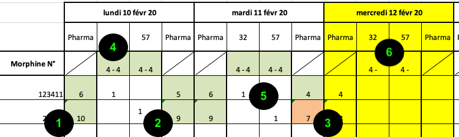

# Cahier des charges, projet CSU-NVB

Ce document décrit les cas d’utilisation de l’application CSU-NVB.

L’objectif du projet est de créer un site web application fonctionnant au moins sur tablettes et permettant aux membres du Centre de Secours et d’Urgences du Nord Vaudois et de la Broie (CSU-NVB) d’effectuer les contrôles journaliers et hebdomadaires usuels.

Le CSU-NVB compte 5 bases : La Vallée-de-Joux, Payerne, Saint-Loup, Sainte-Croix et Yverdon.

Chaque base a 2 ou 3 véhicules (ambulances), mais les véhicules ne sont pas attribués à une base. Une ambulance d'un site va parfois remplacer une d'un autre site qui est par exemple en réparation.

Il y a environ 110 secouristes sur l’ensemble du CSU-NVB, chacun(e) étant rattaché(e) à une base. Dans cette application, on considère que tout le monde a le même rôle dans l’organisation.

Le site gère trois types de checklists :

1.	Le stock de stupéfiants, à la semaine (qu’on appellera « Page Stup » dans ce document)

2.	Les tâches hebdomadaires de la base (qu’on appellera « Page Todo » dans ce document)

3.	La remise de garde quotidienne (qu’on appellera « Page Remise » dans ce document)

# Use Cases

## Se connecter

En arrivant sur le site, le(la) secouriste est invité(e) à se connecter avec son nom d’utilisateur et mot de passe, ainsi qu'une des 5 bases CSU.

Une fois connecté(e), le site propose un accès aux trois types de pages (Stup, Todo, Remise), pour la base que le(la) secouriste a sélectionée au login. De plus un message d'avertissement est affiché en cas d'état incorrect de la balance des stupéfiants.

Pour les admins, un accès à la page d’administration est proposé.

## Gérer des secouristes (admin)

- Login
- Nouveu secouriste. L'administrateur le crée, il a un status de 'nouveau'. Quand la personne va sur le site pour la première fois, elle va à la page d'activation, où elle définit son mdp
- Les admins gèrent les secouristes
  - Donner/Retirer le droit d’administrer (sauf à soi-même)
  - Choix de la base

## Gérer une liste de bases (admin)
- Afficher la liste. Clic -> gérer la base
- Créer
- Renommer
- Supprimer (s’il n’y a plus de données associées)

## Gérer une base (admin)

- Liste des modèles STUP, Todolist et Remise

  - Si le dernier n’a pas encore été utilisé

     - Clic -> édition
     - Bouton permettant de le désigner comme actif
  
  - Si le dernier a été utilisé -> bouton permettant de créer une nouvelle version
- Liste des véhicules
- Archiver les données

## Remplir une Todolist (secouriste, pour une base choisie)
- Page initiale: Liste (=tableau) de tous les formulaires de tâches
  - Date, liste des contributeurs, nom de celui qui a clôturé
  - Clic -> Vue détaillée -> clic bouton download -> format pdf
- Un bouton permet de passer directement à l'édition de la todolist en cours (il y en a toujours une)
- La page d’édition se présente en 7 colonnes sur un grand affichage et en une colonne sur un petit affichage
- Il y a deux types de cases : toggle et input. Les cases input ont un champ 'Nova' (=ambulance) qui est un texte
- Clic sur une case toggle vierge -> elle devient quittancée par le secouriste
- Clic sur une case toggle déjà quittancée par le secouriste connecté -> elle redevient vierge
- Introduction d’une valeur dans une case input vierge -> elle devient quittancée par le secouriste
- Une case input quittancée par un autre secouriste ne peut pas être modifiée
- Une case input déjà quittancée par le secouriste connecté peut être modifiée. Si la valeur donnée est nulle, la case redevient vierge

## Remplir une page Stup (secouriste, pour une base choisie)
- Page initiale: Liste (=tableau) de tous les formulaires Stup
  - Date, liste des contributeurs
  - Clic -> Vue détaillée -> clic bouton download -> format pdf
- Un bouton permet de passer directement à l'édition de la feuille de stup en cours (il y en a toujours une)
- La page d’édition se présente en 7 colonnes sur un grand affichage et en une colonne sur un petit affichage
- Chaque cellule est un input numérique si la journée n’a pas été clôturée
- Un bouton permet d’ajouter une ligne pour un médicament 
- En bas de chaque jour, il y a un bouton qui permet de clore la journée. Ce bouton demande une confirmation
- La feuille complète est clôturée quand chacun des jours a été clôturé

Suite à la réunion tenue à Ste-Croix, la page des stups sera proposée sous la forme suivante:

Explications:

1. En début de journée, le décompte des médicaments en pharmacie est fait lot par lot et introduit
2. En fin de journée, le décompte des médicaments en pharmacie est fait lot par lot et introduit. La cellule est en vert si le compte est juste
3. La cellule est en rouge si le compte est faux
4. Les ambulancier font le décompte des médicaments à bord des ambulances, sans tenir compte des lots. Ils le font en début de garde et à la fin. Les deux nombres sont sensés toujours être les mêmes
5. Les secouristes prennent des médicaments dans la pharmacie pour compléter le stock à bord de l'ambulance. Quand ils le font, ils note combien ils en ont pris dans quel lot.
6. La colonne jaune est le jour en cours. Les données sont donc partielles.

## Faire une remise de garde (secouriste)
- Page initiale: Liste (=tableau) de tous les formulaires de remise
  - Date, responsable, équipiers, vehicules, pour le jour et pour la nuit
  - Clic -> Vue détaillée -> clic bouton download -> format pdf
- Un bouton permet de passer directement à l'édition de la garde en cours (il y en a toujours une)
- Page d'édition de la remise:
  - Si la personne connectée n'est pas enregistrée dans cette garde, elle peut s'inscrire pour le jour ou pour la nuit
  - Il y a trois colonnes: Jour, Nuit et Remarque
  - Jour et Nuit: la case est blanche et vide ou verte avec les initiales de la persone qui a coché
  - Un utilisateur connecté et enregistré dans la garde peut cliquer une case pour la quittancer ou dé-quittancer
  - Remarque est un texte libre. S'il est rempli, il est suivi d'une case à cocher 'Reporter', qui est cochée par défaut
  - Un bouton permet l'accès direct à la page Stup en cours
  - Un bouton permet l'accès direct à la page Tâches en cours
  - Le dimanche (et seulement le dimanche), deux lignes supplémentaires de la section 'Centrale & tâches' permettent de quittancer la clôture des tâches et stup
- Bouton pour clôturer la journée
- Bouton pour clôturer la nuit
- Lors de la clôture de la nuit
  - Une feuille est créée pour la garde suivante
  - Les remarques qui ont la case 'Reporter' cochée dans la garde fermée sont recopiées dans la nouvelle garde

